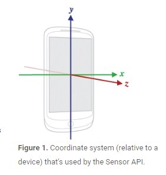

九轴传感器

* 三轴加速度计
    * 主要用于线性加速度及倾斜度测量，还可以通过计算得出速度相对距离等信息 
    * 不能区分重力加速度和其他加速度 
    * 线性距离通过综合计算得出，只是相对距离，存在累计误差   

* 三轴陀螺仪（角速度传感器）
    * 测量旋转率（角速度）的绝对值，综合计算可得出相对旋转角度 
    * 快速精确 
    * 不受线性加速度及周围磁场影响 
    * 相对的旋转角度在长时间使用后，存在累积误差 

* 三轴磁力计（电子罗盘）
    * 测量地磁场，并通过磁场变化得出方向绝对值 
    * 易受其他磁场干扰 
    * 需要补偿

---

原文链接：[https://blog.csdn.net/dabenxiong666/article/details/53836503](https://blog.csdn.net/dabenxiong666/article/details/53836503)

**目录**
* TOC
{:toc}
---

## 0. 前言

传感器的调试过程，一般根据原厂提供demo代码，调试数据接口，将数据流打通即可，在VR中，当带上头显设备，运行应用时，出现漂移、延迟、不回归问题，往往束手无策，解决这些小问题，往往占用很多的时间，希望通过自己整理的知识，明确调试的方向，提高调试效率，达到好的调试效果。自己近几年在Android平台上导入过多种9轴传感器，做过一些sensor内部分享，而且近半年来从事VR开发工作，VR对9轴传感器要求比手机、平板严格更多，遇到的问题也更多，在开发过程中不断学习和思考，与传感器原厂RD沟通和学习，对9轴传感器有了更深的认识，这整理、分享一下所学知识，希望这篇文章对大家理解9轴传感器有所帮助,:)，欢迎大家批评指正。

## 1. 9轴传感器

9轴传感器包括3轴加速度计、3轴陀螺仪、3轴磁力计，在实际应用中，需要把这些数据需要经过融合算法后，才能够被应用程序使用，下面对每种传感器功能、原理以及融合算法进行介绍。

### 1.1 加速度计

人们常说的G-sensor，用来检测物理在X、Y、Z轴上的重力加速度，单位:m/s^2\.   
以手机为例，X、Y、Z轴如下图所示（右手坐标系）：

### 1.2 陀螺仪

### 1.3 磁力计

## 2. 融合算法

## 3. 传感器调试

## 4. 9轴方案选择

## 5. 参考链接

* [oculars sensor doc](https://developer3.oculus.com/blog/sensor-fusion-keeping-it-simple/)   
* [starlino Imu introduce](http://www.starlino.com/imu_guide.html)   
* [goole sensor introduce](https://developer.android.com/guide/topics/sensors/sensors_overview.html)   
* [geek-workshop](http://www.geek-workshop.com/thread-1695-1-1.html)   
* [捷联惯导算法心得](http://www.amobbs.com/thread-5492189-1-1.html)

