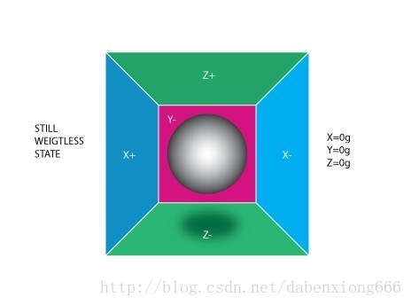
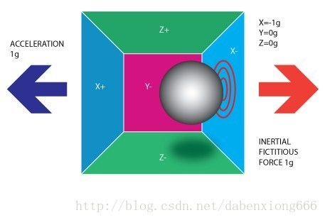
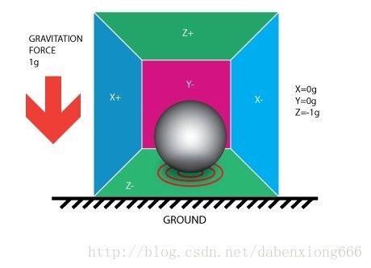
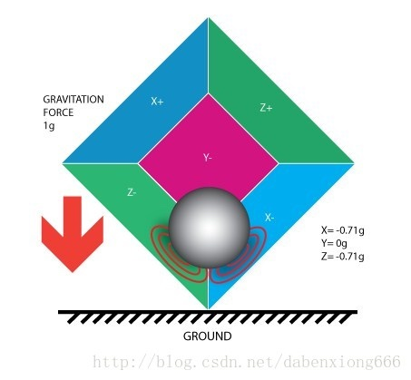
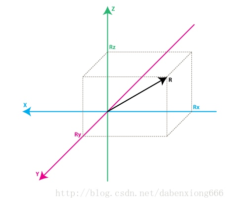
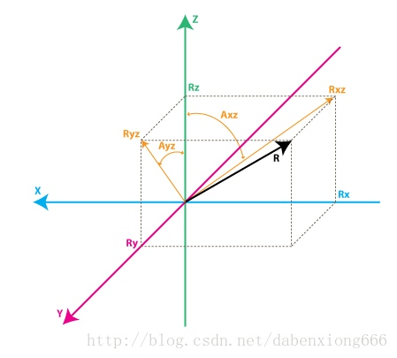

九轴传感器

* 三轴加速度计
    * 主要用于线性加速度及倾斜度测量，还可以通过计算得出速度相对距离等信息 
    * 不能区分重力加速度和其他加速度 
    * 线性距离通过综合计算得出，只是相对距离，存在累计误差   

* 三轴陀螺仪（角速度传感器）
    * 测量旋转率（角速度）的绝对值，综合计算可得出相对旋转角度 
    * 快速精确 
    * 不受线性加速度及周围磁场影响 
    * 相对的旋转角度在长时间使用后，存在累积误差 

* 三轴磁力计（电子罗盘）
    * 测量地磁场，并通过磁场变化得出方向绝对值 
    * 易受其他磁场干扰 
    * 需要补偿

---

原文链接：[https://blog.csdn.net/dabenxiong666/article/details/53836503](https://blog.csdn.net/dabenxiong666/article/details/53836503)

目录
* TOC
{:toc}
---

## 0. 前言

传感器的调试过程，一般根据原厂提供demo代码，调试数据接口，将数据流打通即可，在VR中，当带上头显设备，运行应用时，出现漂移、延迟、不回归问题，往往束手无策，解决这些小问题，往往占用很多的时间，希望通过自己整理的知识，明确调试的方向，提高调试效率，达到好的调试效果。自己近几年在Android平台上导入过多种9轴传感器，做过一些sensor内部分享，而且近半年来从事VR开发工作，VR对9轴传感器要求比手机、平板严格更多，遇到的问题也更多，在开发过程中不断学习和思考，与传感器原厂RD沟通和学习，对9轴传感器有了更深的认识，这整理、分享一下所学知识，希望这篇文章对大家理解9轴传感器有所帮助,:)，欢迎大家批评指正。

## 1. 九轴传感器

9轴传感器包括3轴加速度计、3轴陀螺仪、3轴磁力计，在实际应用中，需要把这些数据需要经过融合算法后，才能够被应用程序使用，下面对每种传感器功能、原理以及融合算法进行介绍。

### 1.1 加速度计

人们常说的G-sensor，用来检测物理在X、Y、Z轴上的重力加速度，单位:m/s^2\.   

以手机为例，X、Y、Z轴如下图所示（右手坐标系）：

当手机平放在桌面时，Z轴指向天空，这时候X、Y轴的数值接近为0，Z轴的重力加速度约为$$9.81m/s^2$$，将手机翻转后，即屏幕面朝向桌面，此时的Z轴重力加速度约为$$-9.81m/s^2$$。X、Y轴指向天空时，与上面Z轴同理，有兴趣的可以在手机上安装一个”sensor_list.apk”来抓取这些数据。

> 原理

[这里是英文介绍](http://www.starlino.com/imu_guide.html)，中文版本如下：   
当我们在想象一个加速度计的时候我们可以把它想作一个圆球在一个方盒子中。你可能会把它想作一个饼干或者甜圈，但我就把它当做一个球好了：

我们假定这个盒子不在重力场中或者其他任何会影响球的位置的场中，球处于盒子的正中央。你可以想象盒子在外太空中，远离任何天体，如果很难想象，那就当做盒子在航天飞机中，一切东西都处于无重力状态。在上面的图中你可以看到我们给每个轴分配了一对墙（我们移除了Y+以此来观察里面的情况）。设想每面墙都能感测压力。如果我们突然把盒子向左移动（加速度为1g=9.8m/s^2），那么球会撞上X-墙。然后我们检测球撞击墙面产生的压力，根据F=ma，计算出X轴加速度输出值为-1g。

请注意加速度计检测到的力方向与它本身加速度的方向是相反的。这种力量通常被称为惯性力或假想力 。在这个模型中你应该明白加速度计是通过间接测量力对一个墙面的作用来测量加速度的，在实际应用中，可能通过弹簧等装置来测量力。这个力可以是加速度引起的，但在下面的例子中，我们会发现它不一定是加速度引起的。   
如果我们把模型放在地球上，球会落在Z-墙面上并对其施加一个1g的力，见下图：

在这种情况下盒子没有移动但我们任然读取到Z轴有-1g的值。球在墙壁上施加的压力是由引力造成的。在理论上，它可以是不同类型的力量，例如，你可以想象我们的球是铁质的，将一个磁铁放在盒子旁边那球就会撞上另一面墙。引用这个例子只是为了说明加速度计的本质是检测力而非加速度。只是加速度所引起的惯性力正好能被加速度计的检测装置所捕获。   
虽然这个模型并非一个MEMS传感器的真实构造，但它用来解决与加速度计相关的问题相当有效。实际上有些类似传感器中有金属小球，它们称作倾角开关，但是它们的功能更弱，只能检测设备是否在一定程度内倾斜，却不能得到倾斜的程度。   
到目前为止，我们已经分析了单轴的加速度计输出，这是使用单轴加速度计所能得到的。三轴加速度计的真正价值在于它们能够检测全部三个轴的惯性力。让我们回到盒子模型，并将盒子向右旋转45度。现在球会与两个面接触：Z-和X-，见下图：

0.71g这个值是不是任意的，它们实际上是1/2的平方根的近似值。我们介绍加速度计的下一个模型时这一点会更清楚。   
在上一个模型中我们引入了重力并旋转了盒子。在最后的两个例子中我们分析了盒子在两种情况下的输出值，力矢量保持不变。虽然这有助于理解加速度计是怎么和外部力相互作用的，但如果我们将坐标系换为加速度的三个轴并想象矢量力在周围旋转，这会更方便计算。

请看看在上面的模型，我保留了轴的颜色，以便你的思维能更好的从上一个模型转到新的模型中。想象新模型中每个轴都分别垂直于原模型中各自的墙面。矢量R是加速度计所检测的矢量（它可能是重力或上面例子中惯性力的合成）。RX，RY，RZ是矢量R在X，Y，Z上的投影。请注意下列关系：   
R ^ 2 = RX ^ 2 + RY ^ 2 + RZ ^ 2（公式1）   
此公式等价于三维空间勾股定理。   
还记得我刚才说的1/2的平方根0.71不是个随机值吧。如果你把它们代回上式，回顾一下重力加速度是1g，那我们就能验证：   
1 ^ 2 =（SQRT（1/2））^ 2 + 0 ^ 2 +（SQRT（1/2））^ 2   
在公式1中简单的取代： R=1, Rx = -SQRT(1/2), Ry = 0 , Rz = -SQRT(1/2)   
经过一大段的理论序言后，我们和实际的加速度计很靠近了。RX，RY，RZ值是实际中加速度计输出的线性相关值，你可以用它们进行各种计算。   
在我们运用它之前我们先讨论一点获取加速度计数据的方法。大多数加速度计可归为两类：数字和模拟。数字加速度计可通过I2C，SPI或USART方式获取信息，而模拟加速度计的输出是一个在预定范围内的电压值，你需要用ADC（模拟量转数字量）模块将其转换为数字值。我将不会详细介绍ADC是怎么工作的，部分原因是这是个很广的话题，另一个原因是不同平台的ADC都会有差别。有些MCU具有内置ADC模块，而有些则需要外部电路进行ADC转换。不管使用什么类型的ADC模块，你都会得到一个在一定范围内的数值。例如一个10位ADC模块的输出值范围在0 .. 1023间，请注意，1023 = 2 ^ 10 -1。一个12位ADC模块的输出值范围在0 .. 4095内，注意，4095 = 2 ^ 12-1。   
我们继续，先考虑下一个简单的例子，假设我们从10位ADC模块得到了以下的三个轴的数据：   
AdcRx = 586   
AdcRy = 630   
AdcRz = 561   
每个ADC模块都有一个参考电压，假设在我们的例子中，它是3.3V。要将一个10位的ADC值转成电压值，我们使用下列公式：   
VoltsRx = AdcRx * VREF / 1023   
小注：8位ADC的最大值是255 = 2 ^ 8 -1，12位ADC最大值是4095 = 2 ^ 12 -1。   
将3个轴的值代入上式，得到：   
VoltsRx = 586 * 3.3 / 1023 =～1.89V（结果取两位小数）   
VoltsRy = 630 * 3.3 / 1023 =～2.03V   
VoltsRz = 561 * 3.3 / 1023 =～1.81V   
每个加速度计都有一个零加速度的电压值，你可以在它的说明书中找到，这个电压值对应于加速度为0g。通过计算相对0g电压的偏移量我们可以得到一个有符号的电压值。比方说，0g电压值 VzeroG= 1.65V，通过下面的方式可以得到相对0g电压的偏移量:   
DeltaVoltsRx = 1.89V - 1.65V = 0.24V   
DeltaVoltsRy = 2.03V - 1.65V = 0.38V   
DeltaVoltsRz = 1.81V - 1.65V = 0.16V   
现在我们得到了加速度计的电压值，但它的单位还不是g（9.8m/s^2），最后的转换，我们还需要引入加速度计的灵敏度（Sensitivity），单位通常是 mV/g。比方说，加速度计的灵敏度 Sensitivity= 478.5mV / g = 0.4785V /g。灵敏度值可以在加速度计说明书中找到。要获得最后的单位为g的加速度，我们使用下列公式计算：   
RX = DeltaVoltsRx /Sensitivity   
RX = 0.24V / 0.4785V / G =～0.5g   
RY = 0.38V / 0.4785V / G =～0.79g   
RZ = 0.16V / 0.4785V / G =～0.33g   
当然，我们可以把所有的步骤全部放在一个式子里，但我想通过介绍每一个步骤以便让你了解怎么读取一个ADC值并将其转换为单位为g的矢量力的分量。   
Rx = (AdcRx * Vref / 1023 – VzeroG) / Sensitivity (公式2)   
Ry = (AdcRy * Vref / 1023 – VzeroG) / Sensitivity   
Rz = (AdcRz * Vref / 1023 – VzeroG) / Sensitivity   
现在我们得到了惯性力矢量的三个分量，如果设备除了重力外不受任何外力影响，那我们就可以认为这个方向就是重力矢量的方向。如果你想计算设备相对于地面的倾角，可以计算这个矢量和Z轴之间的夹角。如果你对每个轴的倾角都感兴趣，你可以把这个结果分为两个分量：X轴、Y轴倾角，这可以通过计算重力矢量和X、Y轴的夹角得到。计算这些角度比你想象的简单，现在我们已经算出了Rx，Ry，Rz的值，让我们回到我们的上一个加速度模型，再加一些标注上去：

我们感兴趣的角度是向量R和X，Y，Z轴之间的夹角，那就令这些角度为Axr，Ayr，Azr。观察由R和Rx组成的直角三角形：   
cos(Axr) = Rx / R , 类似的：   
cos(Ayr) = Ry / R   
cos(Azr) = Rz / R   
从公式1我们可以推导出 R = SQRT( Rx^2 + Ry^2 + Rz^2)   
通过arccos()函数（cos()的反函数）我们可以计算出所需的角度：   
Axr = arccos(Rx/R)   
Ayr = arccos(Ry/R)   
Azr = arccos(Rz/R)   
我们花了大段的篇幅来解释加速度计模型，最后所要的只是以上这几个公式。根据你的应用场合，你可能会用到我们推导出来的几个过渡公式。我们接下来要介绍陀螺仪模块，并向大家介绍怎么融合加速度计和陀螺仪的数据以得到更精确的倾角值。   
但在此之前，我们再介绍几个很常用的公式：   
cosX = cos(Axr) = Rx / R   
cosY = cos(Ayr) = Ry / R   
cosZ = cos(Azr) = Rz / R   
这三个公式通常称作方向余弦 ，它主要表达了单位向量（长度为1的向量）和R向量具有相同的方向。你可以很容易地验证：   
SQRT（cosX ^ 2 + COSY ^ 2 + cosZ ^ 2）= 1   
这是个很好的性质，因为它避免了我们一直检测R向量的模（长度）。通常如果我们只是对惯性力的方向感兴趣，那标准化模长以简化其他计算是个明智的选择。

> 常用加速度传感器

加速度计种类繁多，MMA、LSM、MPU、BMA等系列，如：MMA7460、MMA8452、MPU6050（A+G）、MPU6800(A+G)、LSM6DSL(A+G)、IMC20603(A+G)、MPU9150（A+G+M）

> 使用场景 

加速度计通过一定的算法，就可以做成我们常用的功能，如：计步器、拍照防抖、GPS补偿、跌落保护、图像旋转、游戏控制器等。

### 1.2 陀螺仪

通常称为Gyro-sensor，用来测量在X、Y、Z轴上的旋转速率，单位:rad/s。   
以手机为例，将手机平放桌面，屏幕朝上，以逆时针方向旋转手机，获得到的是Z轴的加速度值。   
有兴趣可以安装“sensor_list.apk”工具，来查看X、Y、Z轴的加速度值。

> 原理 

对于陀螺仪我们将不会像加速度计一样介绍它的等价盒子模型，而是直接跳到加速度计的第二个模型，通过这个模型我们会向大家介绍陀螺仪是怎么工作的。

陀螺仪的每个通道检测一个轴的旋转。例如，一个2轴陀螺仪检测绕X和Y轴的旋转。为了用数字来表达这些旋转，我们先引进一些符号。首先我们定义：   
Rxz – 惯性力矢量R在XZ平面上的投影   
Ryz – 惯性力矢量R在YZ平面的上投影   
在由Rxz和Rz组成的直角三角形中，运用勾股定理可得：   
Rxz^2 = Rx^2 + Rz^2 ，同样：   
Ryz^2 = Ry^2 + Rz^2   
同时注意：   
R^2 = Rxz^2 + Ry^2 ，这个公式可以公式1和上面的公式推导出来，也可由R和Ryz所组成的直角三角形推导出来   
R ^ 2 = Ryz ^ 2 + RX ^ 2   
在这篇文章中我们不会用到这些公式，但知道模型中的那些数值间的关系有助于理解。   
相反，我们按如下方法定义Z轴和Rxz、Ryz向量所成的夹角：   
AXZ - Rxz（矢量R在XZ平面的投影）和Z轴所成的夹角   
AYZ - Ryz（矢量R在YZ平面的投影）和Z轴所成夹角   
现在我们离陀螺仪要测量的东西又近了一步。陀螺仪测量上面定义的角度的变化率。换句话说，它会输出一个与上面这些角度变化率线性相关的值。为了解释这一点，我们先假设在t0时刻，我们已测得绕Y轴旋转的角度（也就是Axz），定义为Axz0，之后在t1时刻我们再次测量这个角度，得到Axz1。角度变化率按下面方法计算：   
RateAxz = (Axz1 – Axz0) / (t1 – t0).   
如果用度来表示角度，秒来表示时间，那这个值的单位就是 度/秒。这就是陀螺仪检测的东西。   
在实际运用中，陀螺仪一般都不会直接给你一个单位为度/秒的值（除非它是个特殊的数字陀螺仪）。就像加速度计一样，你会得到一个ADC值并且要用类似公式2的式子将其转换成单位为 度/秒的值。让我们来介绍陀螺仪输出值转换中的ADC部分（假设使用10位ADC模块，如果是8位ADC，用1023代替255，如果是12为ADC用4095代替1023）。   
RateAxz = (AdcGyroXZ * Vref / 1023 – VzeroRate) / Sensitivity 公式3   
RateAyz = (AdcGyroYZ * Vref / 1023 – VzeroRate) / Sensitivity   
AdcGyroXZ，AdcGyroYZ - 这两个值由ADC读取，它们分别代表矢量R的投影在XZ和YZ平面内里的转角，也可等价的说，旋转可分解为单独绕Y和X轴的运动。   
Vref – ADC的参考电压，上例中我们使用3.3V   
VzeroRate – 是零变化率电压，换句话说它是陀螺仪不受任何转动影响时的输出值，对调试板来说，可以认为是1.23V（此值通常可以在说明书中找到——但千万别相信这个值，因为大多数的陀螺仪在焊接后会有一定的偏差，所以可以使用电压计测量每个通道的输出值，通常这个值在焊接后就不会改变，如果有跳动，在设备使用前写一个校准程序对其进行测量，用户应当在设备启动的时候保持设备静止以进行校准）。   
Sensitivity –陀螺仪的灵敏度，单位mV/(deg/s)，通常写作mV/deg/s,它的意思就是如果旋转速度增加1°/s,陀螺仪的输出就会增加多少mV。调试板的灵敏度值是2mV/deg/s或0.002V/deg/s   
让我们举个例子，假设我们的ADC模块返回以下值：   
AdcGyroXZ = 571   
AdcGyroXZ = 323   
用上面的公式，在代入调试板的参数，可得：   
RateAxz = (571 * 3.3V / 1023 – 1.23V) / ( 0.002V/deg/s) =~ 306 deg/s   
RateAyz = (323 * 3.3V / 1023 – 1.23V) / ( 0.002V/deg/s) =~ -94 deg/s   
换句话说设备绕Y轴（也可以说在XZ平面内）以306°/s速度和绕X轴（或者说YZ平面内）以-94°/s的速度旋转。请注意，负号表示该设备朝着反方向旋转。按照惯例，一个方向的旋转是正值。一份好的陀螺仪说明书会告诉你哪个方向是正的，否则你就要自己测试出哪个旋转方向会使得输出脚电压增加。最好使用示波器进行测试，因为一旦你停止了旋转，电压就会掉回零速率水平。如果你使用的是万用表，你得保持一定的旋转速度几秒钟并同时比较电压值和零速率电压值。如果值大于零速率电压值那说明这个旋转方向是正向。

> 常用陀螺仪传感器 

目前市面上较多的都是二合一模块（加速度+陀螺仪），如：MPU6050（A+G）、MPU6800(A+G)、LSM6DSL(A+G)、IMC20603(A+G)、MPU9150（A+G+M）。

> 使用场景 

航海、航空、游戏、拍照防抖、控制等。

### 1.3 磁力计

> 原理

[ST对电子罗盘的详细介绍](http://www.stmcu.org/article/id-261634)

> 常用磁力计传感器 

AKM8963（很经典的一颗，目前停产）、AKM09911、AKM09915、LIS3MDL，磁传感器目前还是AKM一家独大，其他家的性能差距还是比较明显的。

> 使用场景 

主要是指南针，在应用中对6轴数据进行偏航校正。

## 2. 融合算法

## 3. 传感器调试

## 4. 九轴方案选择

## 5. 参考链接

* [oculars sensor doc](https://developer3.oculus.com/blog/sensor-fusion-keeping-it-simple/)   
* [starlino Imu introduce](http://www.starlino.com/imu_guide.html)   
* [goole sensor introduce](https://developer.android.com/guide/topics/sensors/sensors_overview.html)   
* [geek-workshop](http://www.geek-workshop.com/thread-1695-1-1.html)   
* [捷联惯导算法心得](http://www.amobbs.com/thread-5492189-1-1.html)

