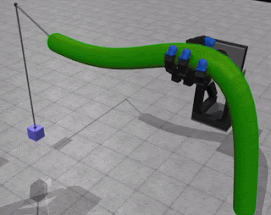
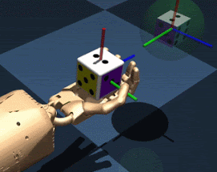
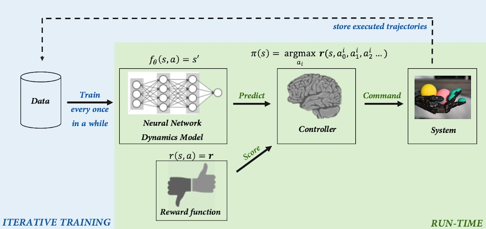
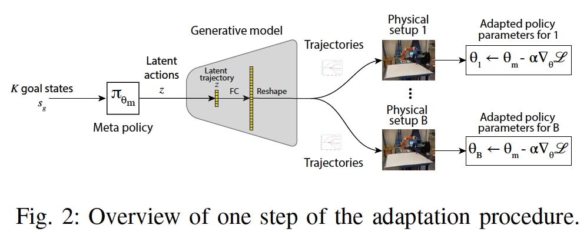
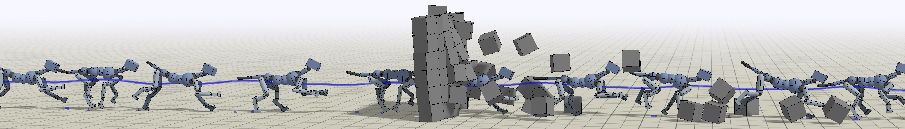
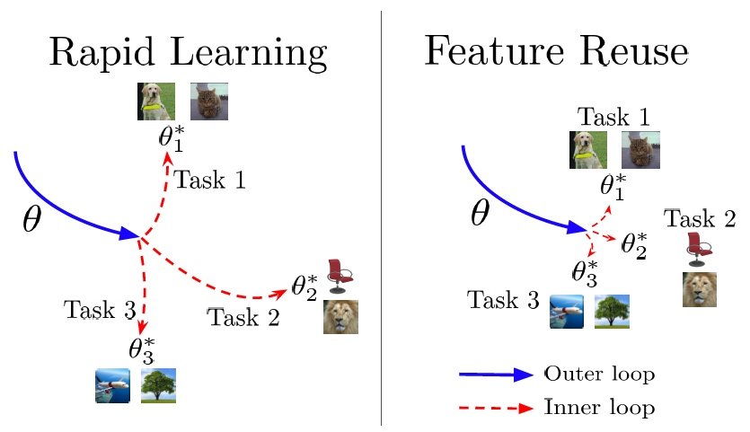
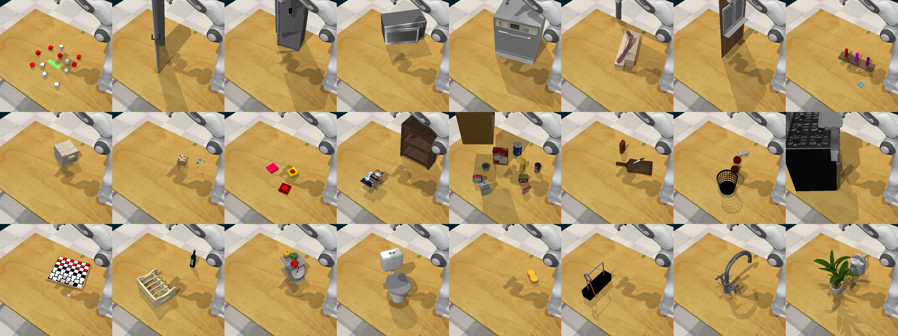

---
**Content**
* TOC
{:toc}
---

## 1. Model-based Learning

* Deep Dynamics Models for Dexterous Manipulation [[Project Home]](https://sites.google.com/view/pddm/) [[Paper]](https://arxiv.org/pdf/1909.11652.pdf) [[Github (coming soon)]]() [[Blog]](https://bair.berkeley.edu/blog/2019/09/30/deep-dynamics/)

    * [Anusha Nagabandi](https://people.eecs.berkeley.edu/~nagaban2/), Kurt Konoglie, Sergey Levine, Vikash Kumar

    * CoRL 2019

    * Note
    
        * Although the basic design of our model-based RL algorithms has been explored in prior work, the particular design decisions that we made were crucial to its performance. We utilize an ensemble of models, which accurately fits the dynamics of our robotic system, and we also utilize a more powerful sampling-based planner that preferentially samples temporally correlated action sequences as well as performs reward-weighted updates to the sampling distribution.
    
    * Design Decisions

        * Model Architecture
        * Warmstart from Previous Model
        * Ensemble Size
        * Controller
        * $$\gamma$$ for Reward-Weighting
        * Horizon
    

	
	
	

* Regression Planning Networks
    
    * [Danfei Xu](https://cs.stanford.edu/~danfei/), Roberto Martín-Martín, De-An Huang, Yuke Zhu, Silvio Savarese, Li Fei-Fei
    
    * Stanford University

    * NIPS 2019

    

* Reddit: [[D] What are some promising research directions for model-based RL?](https://www.reddit.com/r/MachineLearning/comments/cy8a6k/d_what_are_some_promising_research_directions_for/)

    * a lot of great progress has been made through advancing terminology,
    
    * e.g.
    
        * "model" -> "world model"
        
        * "prediction" -> "imagination"
        
        * "exploiting modelling error" -> "hacking"
    
    * so "predicition errors in the model result in suboptimal actions" becomes "unfortunately the agent learnt to hack its world model when using its imagination", which sounds much more advanced!

## 2. Hierarchical Learning

* Why Does Hierarchy (Sometimes) Work So Well in Reinforcement Learning? [[Paper]](https://arxiv.org/pdf/1909.10618.pdf)

    * Ofir Nachum, Haoran Tang, Xingyu Lu, Shixiang Gu, Honglak Lee, Sergey Levine
    
    * Google AI & UC Berkeley

    * Note

        * 本文主要探究在强化学习中层次化奏效的原因，实验结果表明层次化奏效的最终原因在于提高了探索效率。

        * Tasks: locomotion, navigation, and manipulation
    
    
    
* Sub-policy Adaptation for Hierarchical Reinforcement Learning [[Home]](https://sites.google.com/view/hippo-rl) [[Paper]](https://arxiv.org/pdf/1906.05862v1)

    * Alexander C. Li, Carlos Florensa, **Ignasi Clavera**, Pieter Abbeel

    * UB Berkeley

    * Contributed talk at the Workshop on `Multi-Task and Lifelong Reinforcement Learning` at `ICML 2019`
   
* Dot-to-Dot: Explainable Hierarchical Reinforcement Learning for Robotic Manipulation

    * Benjamin Beyret, Ali Shafti, A. Aldo Faisal

     
## 3. RL in Real World

* Meta Reinforcement Learning for Sim-to-real Domain Adaptation [[Paper]](https://arxiv.org/pdf/1909.12906.pdf)

    * Karol Arndt, Murtaza Hazara, Ali Ghadirzadeh, Ville Kyrki

    * Aalto University, Espoo, Finland (阿尔托大学, 芬兰)
    
    * KTH Royal Institute of Technology, Stockholm, Sweden (瑞典皇家理工学院)

* A Survey on Reproducibility by Evaluating Deep Reinforcement Learning Algorithms on Real-World Robots [[Paper]](https://arxiv.org/pdf/1909.03772v2) [[Github]](https://github.com/dti-research/SenseActExperiments)

    * Nicolai A. Lynnerup, Laura Nolling, Rasmus Hasle, John Hallam

    * Danish Technological Institute (DTI, 丹麦技术研究院) 
    
    * University of Southern Denmark (SDU, 南丹麦大学)

    * CoRL 2019

* Learning Fast Adaptation with Meta Strategy Optimization

<iframe width="700" height="394" src="https://www.youtube.com/embed/Mm3IIEZ0-Nw" frameborder="0" allowfullscreen></iframe>

## 4. Reinforcement Learning

* Advantage-Weighted Regression: Simple and Scalable Off-Policy Reinforcement Learning [[Project Home]](https://xbpeng.github.io/projects/AWR/index.html) [[Paper]](https://xbpeng.github.io/projects/AWR/2019_AWR.pdf) [[Github]](https://github.com/xbpeng/awr)
    
    * UC Berkeley

    * Xue Bin Peng, Aviral Kumar, Grace Zhang, Sergey Levine

## 5. Meta Learning

* [(机器之心编译) 让机器人看一眼就能模仿：One-Shot模仿学习发展情况](https://mp.weixin.qq.com/s/IAK5OA-GFIWBd3FkRU2A2Q)

* Stanford Course - CS 330:	**Deep Multi-Task and Meta Learning** (Fall 2019）[[Homepage]](http://cs330.stanford.edu/)

* Rapid Learning or Feature Reuse? Towards Understanding the Effectiveness of MAML [[Paper]](https://arxiv.org/pdf/1909.09157.pdf)

    * Aniruddh Raghu, Maithra Raghu, Samy Bengio, Oriol Vinyals

    * MIT & Cornell University & Google Brain & DeepMind

    * Note

        * 本文主要探究MAML算法奏效的原因是在于**快速学习(Rapid learning)**还是**特征重用(Feature reuse)**，实验结果表明特征重用是MAML奏效的主要原因。

        * Despite MAML’s popularity, a fundamental open question remains – is the effectiveness of MAML due to the **meta-initialization being primed for rapid learning (large, efficient changes in the representations)** or due to **feature reuse, with the meta initialization already containing high quality features**? We investigate this question, via ablation studies and analysis of the latent representations, **finding that feature reuse is the dominant factor**.
        
        * `Rapid learning v.s. Feature reuse paradigms`. In Rapid Learning, **outer loop training** leads to a parameter setting that is well-conditioned for fast learning, and **inner loop updates** result in significant **task specialization**. In Feature Reuse, the outer loop leads to parameter values corresponding to reusable features, from which the parameters do not move significantly in the inner loop.

    

## 6. Robot 

* ROBEL: Robotics Benchmarks for Learning with Low-Cost Robots [[Project Home]](https://sites.google.com/view/roboticsbenchmarks/) [[Paper]](https://arxiv.org/pdf/1909.11639.pdf) [[Github]](https://github.com/google-research/robel)

    * Michael Ahn, Henry Zhu, Kristian Hartikainen, Hugo Ponte, Abhishek Gupta, Sergey Levine, Vikash Kumar
    
    * UC Berkeley & Google Brain
    
    * CoRL 2019

    * Note

        * ROBEL is an open-source platform of cost-effective robots designed for **reinforcement learning in the real world**.

* RLBench: The Robot Learning Benchmark & Learning Environment [[Project Home]](https://sites.google.com/view/rlbench) [[Paper]](https://arxiv.org/pdf/1909.12271) [[Github]](https://github.com/stepjam/RLBench)

    * Stephen James, Zicong Ma, David Rovick Arrojo, Andrew J. Davison

    * Dyson Robotics Lab, Imperial College London

    * RLBench is an ambitious large-scale benchmark and learning environment featuring 100 unique, hand-design tasks, tailored to facilitate research in a number of **vision-guided manipulation** research areas, including: **reinforcement learning, imitation learning, multi-task learning, geometric computer vision, and in particular, few-shot learning**.

* Efficient  Bimanual  Manipulation  Using  Learned  Task  Schemas [[Paper]](https://arxiv.org/pdf/1909.13874) [[Video]](https://www.youtube.com/watch?v=TBUEHk37a64)

    * Rohan Chitnis, Shubham Tulsiani, Saurabh Gupta, Abhinav Gupta
   
    * MIT & Facebook 

    * Note

        * Our insight is that for many tasks, the learning process can be decomposed into learning a **state-independent** task schema (a sequence of skills to execute) and a policy to choose the parameterizations of the skills in a **state-dependent** manner.

<iframe width="700" height="394" src="https://www.youtube.com/embed/TBUEHk37a64" frameborder="0" allowfullscreen></iframe>

## 7. Others

* Article: [An overview of gradient descent optimization algorithms](http://ruder.io/optimizing-gradient-descent/)