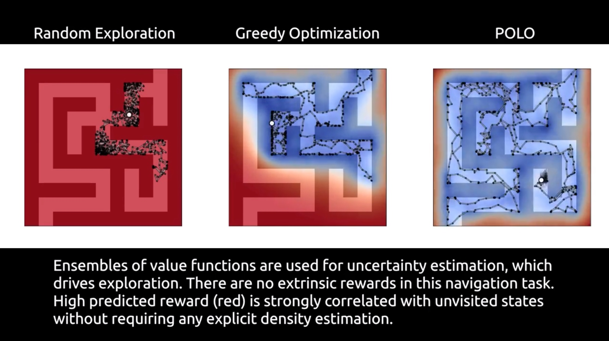
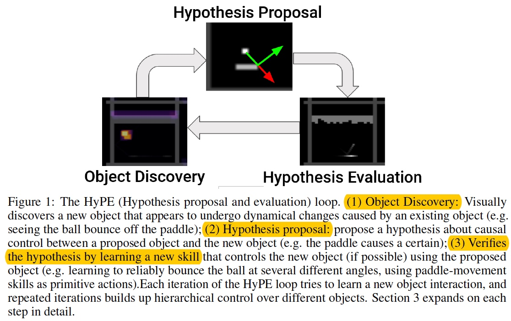

---
**Content**
* TOC
{:toc}
---

## 1. Model-based Learning

* Model Imitation for Model-Based Reinforcement Learning [[Paper]](https://arxiv.org/pdf/1909.11821)

    * Yueh-Hua Wu, Ting-Han Fan, Peter J. Ramadge, Hao Su

    * National Taiwan University, University of California San Diego, Princeton University

    * Note

        * Model-based reinforcement learning (MBRL) aims to learn a dynamic model to reduce the number of interactions with real-world environments. However, due to estimation error, rollouts in the learned model, especially those of long horizon, fail to match the ones in real-world environments. This mismatching has seriously impacted the sample complexity of MBRL. **The phenomenon can be attributed to the fact that previous works employ supervised learning to learn the one-step transition models, which has inherent difficulty ensuring the matching of distributions from multi-step rollouts.**

        * We propose an MBRL method called model imitation (MI), which enforces the learned transition model to generate similar rollouts to the real one so that policy gradient is accurate;

* Deep Dynamics Models for Dexterous Manipulation [[Project Home]](https://sites.google.com/view/pddm/) [[Paper]](https://arxiv.org/pdf/1909.11652.pdf) [[Github (coming soon)]]() [[Blog]](https://bair.berkeley.edu/blog/2019/09/30/deep-dynamics/)

    * [Anusha Nagabandi](https://people.eecs.berkeley.edu/~nagaban2/), Kurt Konoglie, Sergey Levine, Vikash Kumar

    * CoRL 2019

    * Note
    
        * Although the basic design of our model-based RL algorithms has been explored in prior work, the particular design decisions that we made were crucial to its performance. We utilize an ensemble of models, which accurately fits the dynamics of our robotic system, and we also utilize a more powerful sampling-based planner that preferentially samples temporally correlated action sequences as well as performs reward-weighted updates to the sampling distribution.
    
    * Design Decisions

        * Model Architecture
        * Warmstart from Previous Model
        * Ensemble Size
        * Controller
        * $$\gamma$$ for Reward-Weighting
        * Horizon
    

	
	
	

* Regression Planning Networks
    
    * [Danfei Xu](https://cs.stanford.edu/~danfei/), Roberto Martín-Martín, De-An Huang, Yuke Zhu, Silvio Savarese, Li Fei-Fei
    
    * Stanford University

    * NIPS 2019

    

* Reddit: [[D] What are some promising research directions for model-based RL?](https://www.reddit.com/r/MachineLearning/comments/cy8a6k/d_what_are_some_promising_research_directions_for/)

    * a lot of great progress has been made through advancing terminology,
    
    * e.g.
    
        * "model" -> "world model"
        
        * "prediction" -> "imagination"
        
        * "exploiting modelling error" -> "hacking"
    
    * so "predicition errors in the model result in suboptimal actions" becomes "unfortunately the agent learnt to hack its world model when using its imagination", which sounds much more advanced!

* Blog: [Model Based Policy Optimization: Reviewing recent advances in model-based reinforcement learning](http://taylorliu.com/2019-09-11-model-based-policy-optimization/)

* Blog: [Three Paradigms of Reinforcement Learning](https://jacobbuckman.com/2019-10-25-three-paradigms-of-reinforcement-learning/) [[中译文]](https://mp.weixin.qq.com/s/NWsHBnlV-Jng9g3g2d7M0g)

* Model-based Lookahead Reinforcement Learning [[Paper]](https://arxiv.org/abs/1908.06012v1)

    * Zhang-Wei Hong, Joni Pajarinen, Jan Peters

    * National Tsing Hua University & TU Darmstadt

    * The contributions of this paper are the following:

        * We show that using an MFRL policy to collect training data improves the quality of the trained forward dynamics model.

        * We show that using an MFRL policy can enhance MPC‘ s performance.

        * We show advantages and limitations of using value function in MPC.

        * We provide a comprehensive evaluation of each design decision for combining MPC and MFRL.

* Hierarchical Foresight: Self-Supervised Learning of Long-Horizon Tasks via Visual Subgoal Generation [[Paper]](https://arxiv.org/abs/1909.05829) [[Github]](https://github.com/google-research/google-research/tree/master/hierarchical_foresight)

    * Suraj Nair, Chelsea Finn

* Dynamics-Aware Unsupervised Discovery of Skills [[Homepage]](https://sites.google.com/view/dads-skill)

    * Archit Sharma, Shixiang Gu, Sergey Levine, Vikash Kumar, Karol Hausman
    
    * Google Brain

* Learning to Paint With Model-based Deep Reinforcement Learning [[Paper]](https://arxiv.org/pdf/1903.04411v3.pdf) [[Github]](https://github.com/hzwer/ICCV2019-LearningToPaint) [[中文报道]](https://zhuanlan.zhihu.com/p/80732065)

    * Zhewei Huang, Wen Heng, Shuchang Zhou

    * Megvii Inc, Peking University

    * ICCV 2019

Figure 2: The overall architecture. (a) At the inference stage, the actor outputs a set of stroke parameters based on the canvas status and target image at each step. The renderer then renders the stroke on the canvas accordingly. (b) At the training stage, the actor is trained with assistants of an adversarial discriminator and a critic. The reward is given by the discriminator at each step, and the training samples are randomly sampled from the replay buffer.

* Low Level Control of a Quadrotor with Deep Model-Based Reinforcement Learning [[Project Home]](https://sites.google.com/berkeley.edu/mbrl-quadrotor/) [[Paper]](https://arxiv.org/pdf/1901.03737v2)

    * Nathan O. Lambert, Daniel S. Drew, Joseph Yaconelli, Roberto Calandra, Sergey Levine, Kristofer S.J. Pister

    * UC Berkeley, Facebook AI Research

    * IROS 2019

* Plan Online, Learn Offline (POLO): Efficient Learning and Exploration via Model-Based Control [[Project Home]](https://sites.google.com/view/polo-mpc) [[Paper]](https://arxiv.org/pdf/1811.01848) [[Github]](https://github.com/aravindr93/trajopt)

    * Kendall Lowrey, Aravind Rajeswaran, Sham Kakade, Emanuel Todorov, Igor Mordatch

    * University of Washington, Roboti LLC, OpenAI

    * ICLR 2019

    * Note

        * POLO is based on the synergistic relationship between local trajectory optimization (MPC), global value function learning, and exploration.

        * POLO combines elements of:

            * Uncertainty estimation and planning for coordinated exploration

            * Value function learning to help guide MPC

            * MPC to accelerate and stabilize value function learning    

## 2. Hierarchical Learning

* Hierarchical Policy Learning is Sensitive to Goal Space Design [[Paper]](https://arxiv.org/pdf/1905.01537)

    * Zach Dwiel, Madhavun Candadai, Mariano Phielipp, Arjun K. Bansal

    * Intel AI Lab
    

* Why Does Hierarchy (Sometimes) Work So Well in Reinforcement Learning? [[Paper]](https://arxiv.org/pdf/1909.10618.pdf)

    * Ofir Nachum, Haoran Tang, Xingyu Lu, Shixiang Gu, Honglak Lee, Sergey Levine
    
    * Google AI & UC Berkeley

    * Note

        * 本文主要探究在强化学习中层次化奏效的原因，实验结果表明层次化奏效的最终原因在于提高了探索效率。

        * Tasks: locomotion, navigation, and manipulation
    
    
    
* Sub-policy Adaptation for Hierarchical Reinforcement Learning [[Home]](https://sites.google.com/view/hippo-rl) [[Paper]](https://arxiv.org/pdf/1906.05862v1)

    * Alexander C. Li, Carlos Florensa, **Ignasi Clavera**, Pieter Abbeel

    * UB Berkeley

    * Contributed talk at the Workshop on `Multi-Task and Lifelong Reinforcement Learning` at `ICML 2019`
   
* Dot-to-Dot: Explainable Hierarchical Reinforcement Learning for Robotic Manipulation

    * Benjamin Beyret, Ali Shafti, A. Aldo Faisal

* Hypothesis-Driven Skill Discovery for Hierarchical Deep Reinforcement Learning [[Paper]](https://arxiv.org/pdf/1906.01408)
    
    * Caleb Chuck, Supawit Chockchowwat, Scott Niekum
    
    * The University of Texas at Austin (德克萨斯大学奥斯汀分校)

* Multi-Agent Manipulation via Locomotion using Hierarchical Sim2Real [[Homepage]](https://sites.google.com/view/manipulation-via-locomotion/home) [[Paper]](https://arxiv.org/abs/1908.05224)

    *  Ofir Nachum, Michael Ahn, Hugo Ponte, Shixiang Gu, Vikash Kumar

* Hierarchical Reinforcement Learning for Quadruped Locomotion [[PDF]](https://arxiv.org/pdf/1905.08926)

    * Deepali Jain, Atil Iscen, and Ken Caluwaerts

    * Google

* Hierarchical Reinforcement Learning with Advantage-Based Auxiliary Rewards [[Paper]](https://arxiv.org/pdf/1910.04450)

    * Siyuan Li, Rui Wang, Minxue Tang, Chongjie Zhang

    * Tsinghua University

    * NIPS 2019

    * Figure 1: A schematic illustration of HAAR carried out in one high-level step. Within high-level step 0, a total of k low-level steps are taken. Then the process continues to high-level step 1 and everything in the dashed box is repeated.

  
## 3. RL in Real World

* Meta Reinforcement Learning for Sim-to-real Domain Adaptation [[Paper]](https://arxiv.org/pdf/1909.12906.pdf)

    * Karol Arndt, Murtaza Hazara, Ali Ghadirzadeh, Ville Kyrki

    * Aalto University, Espoo, Finland (阿尔托大学, 芬兰)
    
    * KTH Royal Institute of Technology, Stockholm, Sweden (瑞典皇家理工学院)

* A Survey on Reproducibility by Evaluating Deep Reinforcement Learning Algorithms on Real-World Robots [[Paper]](https://arxiv.org/pdf/1909.03772v2) [[Github]](https://github.com/dti-research/SenseActExperiments)

    * Nicolai A. Lynnerup, Laura Nolling, Rasmus Hasle, John Hallam

    * Danish Technological Institute (DTI, 丹麦技术研究院) 
    
    * University of Southern Denmark (SDU, 南丹麦大学)

    * CoRL 2019

* Learning Fast Adaptation with Meta Strategy Optimization [[Paper]](https://arxiv.org/pdf/1909.12995.pdf)

    * [Wenhao Yu](https://wenhaoyu.weebly.com/), Jie Tan, Yunfei Bai, Erwin Coumans, Sehoon Ha

    * Google Brain, Georgia Institute of Technology

    
<iframe width="700" height="394" src="https://www.youtube.com/embed/Mm3IIEZ0-Nw" frameborder="0" allowfullscreen></iframe>

* Learning agile and dynamic motor skills for legged robots [[Paper]](https://arxiv.org/pdf/1901.08652)

    * Jemin Hwangbo, Joonho Lee, Alexey Dosovitskiy, Dario Bellicoso, Vassilios Tsounis, Vladlen Koltun, Marco Hutter

    * ETH Zurich

    * Science Robotics 2019

<iframe width="700" height="394" src="https://www.youtube.com/embed/aTDkYFZFWug" frameborder="0" allowfullscreen></iframe>

## 4. Reinforcement Learning

* Blog: [Reinforcement Learning Papers Accepted to NeurIPS 2019](https://www.endtoend.ai/blog/neurips2019-rl/)

* Blog: [Curiosity-Driven Learning through Next State Prediction](https://medium.com/data-from-the-trenches/curiosity-driven-learning-through-next-state-prediction-f7f4e2f592fa)

* Advantage-Weighted Regression: Simple and Scalable Off-Policy Reinforcement Learning [[Project Home]](https://xbpeng.github.io/projects/AWR/index.html) [[Paper]](https://xbpeng.github.io/projects/AWR/2019_AWR.pdf) [[Github]](https://github.com/xbpeng/awr)
    
    * UC Berkeley

    * Xue Bin Peng, Aviral Kumar, Grace Zhang, Sergey Levine

* How Much Do Unstated Problem Constraints Limit Deep Robotic Reinforcement Learning? [[Paper]](https://arxiv.org/pdf/1909.09282)

    * W. Cannon Lewis II, Mark Moll, Lydia E. Kavraki

    * Rice University (莱斯大学)

    * Note
        
        * In this paper we present a novel empirical analysis which shows that the unstated spatial constraints in commonly used implementations of Reacher tasks make it dramatically easier to learn a successful control policy with Deep Deterministic Policy Gradients (DDPG), a state-of-the-art Deep RL algorithm.

        * Our analysis suggests that less constrained Reacher tasks are significantly more difficult to learn, and hence that existing de facto benchmarks are not representative of the difficulty of general robotic manipulation.

        * We find that for a particular sort of robotic task, a popular Deep Reinforcement Learning algorithm only succeeds when non-physical limitations are placed on the problem.

        * The main contribution of this paper is an analysis showing that the “Reacher” tasks used in prior works are not repre sentative of the full difficulty presented by general robotic manipulation (or even basic pick-and-place tasks).

        * Our results strongly suggest that **1)** more exploration is necessary into how Deep Robotic RL benchmarks should be defined and run and that **2)** more work is needed before popular Deep RL methods will be capable of learning control policies for general robotic tasks.

* On Learning Symmetric Locomotion [[Project Home]](https://www.cs.ubc.ca/~van/papers/2019-MIG-symmetry/index.html) [[Paper]](https://www.cs.ubc.ca/~van/papers/2019-MIG-symmetry/2019-MIG-symmetry.pdf) [[Github]](https://github.com/UBCMOCCA/SymmetricRL)
    
    * Farzad Abdolhosseini, Hung Yu Ling, Zhaoming Xie, Xue Bin Peng, Michiel van de Panne

    * UC Berkeley, University of British Columbia
    
    * Note
        
        * Four way of incorporating symmetry constraints in RL problems:  (1) policy structure; (2) data augmentation; (3) symmetry loss; (4) motion phase.

* Blog: [Reinforcement Learning Tutorial with Open AI Gym - Reinforcement learning applied for bipedal walker environment](https://towardsdatascience.com/reinforcement-learning-tutorial-with-open-ai-gym-6215a7a15970)

* Assistive Gym: A Physics Simulation Framework for Assistive Robotics [[Paper]](https://arxiv.org/pdf/1910.04700.pdf) [[Github]](https://github.com/Healthcare-Robotics/assistive-gym)

    * Zackory Erickson, Vamsee Gangaram, Ariel Kapusta, [C. Karen Liu](https://www.cs.stanford.edu/~karenliu/Home.html), Charles C. Kemp

    * Georgia Institute of Technology

* DeepGait: Planning and Control of Quadrupedal Gaits using Deep Reinforcement Learning [[Paper]](https://arxiv.org/pdf/1909.08399.pdf) [[Video]](https://www.youtube.com/watch?v=-y2tewOqWAo&feature=youtu.be)

    * Vassilios Tsounis, Mitja Alge, Joonho Lee, Farbod Farshidian, Marco Hutter

    * ETH Zurich

    * Note

        * Our contribution with this work is proposing a method that combines state-of-the-art model-based and DRL methods to enable quadrupedal systems to traverse complex nonflat terrain. **To achieve this, we first decompose locomotion into two parts: (1) a terrain-aware planning policy which can generate sequences of supporting footholds and base motions which direct the robot towards a target heading, and (2) a foothold and base motion controller policy which executes the aforementioned sequence while maintaining balance as well as dealing with external disturbances.**

        * We propose a two-level hierarchy comprising **a high-level Gait Planner (GP)** and **a low-level Gait Controller (GC)** operating at different time-scales.

* Wasserstein Robust Reinforcement Learning [[Paper]](https://arxiv.org/pdf/1907.13196) [[中文报道]](https://mp.weixin.qq.com/s/BAewjNxUopXczGeR35afEg)

    * Mohammed Amin Abdullah, Hang Ren, Haitham Bou Ammar, Vladimir Milenkovic, Rui Luo, Mingtian Zhang, Jun Wang

    * 华为诺亚方舟实验室伦敦决策推理团队

## 5. Meta Learning

* [(机器之心编译) 让机器人看一眼就能模仿：One-Shot模仿学习发展情况](https://mp.weixin.qq.com/s/IAK5OA-GFIWBd3FkRU2A2Q)

* Blog: [The Rise of Meta Learning](https://towardsdatascience.com/the-rise-of-meta-learning-9c61ffac8564) [[中文编译]](https://mp.weixin.qq.com/s?__biz=MzU2OTA0NzE2NA==&mid=2247515772&idx=1&sn=6f21bb0351e262c89345caa433e34442&chksm=fc865f6fcbf1d679ad9b5af978e0f8ab189bd76e45796c408c7cc5bdb3f563df41c740b7bfe5&mpshare=1&scene=1&srcid=&sharer_sharetime=1571480907712&sharer_shareid=3230aa8d692bbd5745277f42012c9308%23rd)

* Stanford Course - CS 330:	**Deep Multi-Task and Meta Learning** (Fall 2019）[[Homepage]](http://cs330.stanford.edu/)

* Rapid Learning or Feature Reuse? Towards Understanding the Effectiveness of MAML [[Paper]](https://arxiv.org/pdf/1909.09157.pdf)

    * Aniruddh Raghu, Maithra Raghu, Samy Bengio, Oriol Vinyals

    * MIT & Cornell University & Google Brain & DeepMind

    * Note

        * 本文主要探究MAML算法奏效的原因是在于**快速学习(Rapid learning)**还是**特征重用(Feature reuse)**，实验结果表明特征重用是MAML奏效的主要原因。

        * Despite MAML’s popularity, a fundamental open question remains – is the effectiveness of MAML due to the **meta-initialization being primed for rapid learning (large, efficient changes in the representations)** or due to **feature reuse, with the meta initialization already containing high quality features**? We investigate this question, via ablation studies and analysis of the latent representations, **finding that feature reuse is the dominant factor**.
        
        * `Rapid learning v.s. Feature reuse paradigms`. In Rapid Learning, **outer loop training** leads to a parameter setting that is well-conditioned for fast learning, and **inner loop updates** result in significant **task specialization**. In Feature Reuse, the outer loop leads to parameter values corresponding to reusable features, from which the parameters do not move significantly in the inner loop.

    

* Meta-World: A Benchmark and Evaluation for Multi-Task and Meta Reinforcement Learning [[Homepage]](https://meta-world.github.io) [[Github]](https://github.com/rlworkgroup/metaworld)
    
    * Stanford, UC Berkeley
    
    * Tianhe Yu (Stanford), Deirdre Quillen (UC Berkeley), Zhanpeng He (Columbia University), Ryan Julian (USC), Karol Hausman (Robotics at Google), Sergey Levine (UC Berkeley), Chelsea Finn (Stanford University)

* Meta-Learning with Implicit Gradients [[Paper]](https://arxiv.org/abs/1909.04630)
    
    * Aravind Rajeswaran, Chelsea Finn, Sham Kakade, Sergey Levine

    * NIPS'19

    * 摘要：智能系统的一个核心能力是能够通过借鉴以往的经验快速学习新任务。基于梯度(或优化)的元学习是近年来出现的一种有效的学习方法。在这个范式中，元参数在外部循环中学习，而特定于任务的模型在内部循环中只使用当前任务的少量数据学习。扩展这些方法的一个关键挑战是需要通过内部循环学习过程进行区分，这可能带来相当大的计算和内存负担。利用隐式微分法，提出了隐式MAML算法，该算法只依赖于内部层次优化的解，而不依赖于内部循环优化器所采用的路径。这有效地将元梯度计算与内部循环优化器的选择解耦。因此，我们的方法对内部循环优化器的选择是不可知的，并且可以优雅地处理许多梯度步骤，而不会消失梯度或内存约束。从理论上，我们证明了隐式MAML可以计算精确的元梯度，其内存占用不超过计算单个内循环梯度所需的内存占用，且不增加总计算成本。实验表明，隐式MAML的这些优点可以转化为基于少量样本图像识别基准的经验增益。
    
    * Blog: [Notes on iMAML: Meta-Learning with Implicit Gradients](https://www.inference.vc/notes-on-imaml-meta-learning-without-differentiating-through/)
    

* PyTorch Meta-learning Framework for Researchers [[Homepage]](http://learn2learn.net/) [[Github]](https://github.com/learnables/learn2learn)

    * learn2learn provides high- and low-level utilities for meta-learning. The high-level utilities allow arbitrary users to take advantage of exisiting meta-learning algorithms. The low-level utilities enable researchers to develop new and better meta-learning algorithms.

    * Some features of learn2learn include:

        * Modular API: implement your own training loops with our low-level utilities.
        
        * Provides various meta-learning algorithms (e.g. MAML, FOMAML, MetaSGD, ProtoNets, DiCE)
        
        * Task generator with unified API, compatible with torchvision, torchtext, torchaudio, and cherry.
        
        * Provides standardized meta-learning tasks for vision (Omniglot, mini-ImageNet), reinforcement learning (Particles, Mujoco), and even text (news classification).
        
        * 100% compatible with PyTorch -- use your own modules, datasets, or libraries!
    
## 6. Robot 

* Blog: [机器人操作的“圣杯问题” -- Bin Picking](https://mp.weixin.qq.com/s?__biz=MzA3NDU2NDk3MQ%3D%3D&mid=2651928622&idx=1&sn=20b8f9e73ee0630447a118ca12c60987&scene=45#wechat_redirect)

    * Note

        * 目前绝大多数Bin Picking核心只是一件事：找到合适的抓取点（或者吸盘的吸取点）。之后具体怎么执行只是影响速度，属于运动规划问题了。

        * 找抓取点主流的方法有三大类：Model-based，Half-model-based，以及Model-free的方法。

* News: [Allen School releases MuSHR robotic race car platform to drive advances in AI research and education](https://news.cs.washington.edu/2019/08/21/allen-school-releases-mushr-robotic-race-car-platform-to-drive-advances-in-ai-research-and-education/)

* Course

    * Columbia: [CS 6731 | Humanoid Robots Spring 2019 | Prof. Peter Allen](http://www.cs.columbia.edu/~allen/S19/schedule.html)

* ROBEL: Robotics Benchmarks for Learning with Low-Cost Robots [[Project Home]](https://sites.google.com/view/roboticsbenchmarks/) [[Paper]](https://arxiv.org/pdf/1909.11639.pdf) [[Github]](https://github.com/google-research/robel)

    * Michael Ahn, Henry Zhu, Kristian Hartikainen, Hugo Ponte, Abhishek Gupta, Sergey Levine, Vikash Kumar
    
    * UC Berkeley & Google Brain
    
    * CoRL 2019

    * Note

        * ROBEL is an open-source platform of cost-effective robots designed for **reinforcement learning in the real world**.

* RLBench: The Robot Learning Benchmark & Learning Environment [[Project Home]](https://sites.google.com/view/rlbench) [[Paper]](https://arxiv.org/pdf/1909.12271) [[Github]](https://github.com/stepjam/RLBench)

    * Stephen James, Zicong Ma, David Rovick Arrojo, Andrew J. Davison

    * Dyson Robotics Lab, Imperial College London

    * RLBench is an ambitious large-scale benchmark and learning environment featuring 100 unique, hand-design tasks, tailored to facilitate research in a number of **vision-guided manipulation** research areas, including: **reinforcement learning, imitation learning, multi-task learning, geometric computer vision, and in particular, few-shot learning**.

* Efficient  Bimanual  Manipulation  Using  Learned  Task  Schemas [[Paper]](https://arxiv.org/pdf/1909.13874) [[Video]](https://www.youtube.com/watch?v=TBUEHk37a64)

    * Rohan Chitnis, Shubham Tulsiani, Saurabh Gupta, Abhinav Gupta
   
    * MIT & Facebook 

    * Note

        * Our insight is that for many tasks, the learning process can be decomposed into learning a **state-independent** task schema (a sequence of skills to execute) and a policy to choose the parameterizations of the skills in a **state-dependent** manner.

<iframe width="700" height="394" src="https://www.youtube.com/embed/TBUEHk37a64" frameborder="0" allowfullscreen></iframe>

## 7. RL Library

* rlpyt: A Research Code Base for Deep Reinforcement
Learning in PyTorch [[Paper]](https://arxiv.org/abs/1909.01500) [[Github]](https://github.com/astooke/rlpyt) [[Blog]](https://bair.berkeley.edu/blog/2019/09/24/rlpyt/) [[机器之心编译
]](https://mp.weixin.qq.com/s?__biz=MzA3MzI4MjgzMw==&mid=2650771231&idx=3&sn=09410e8fd9f34cacfac7df6abf4d9973&chksm=871a4b61b06dc2778fbfcceb1da1c35500a49132303536935f20496da46e2939411c29416498&mpshare=1&scene=1&srcid=&sharer_sharetime=1570379699646&sharer_shareid=3230aa8d692bbd5745277f42012c9308#rd)

    * Adam Stooke, Pieter Abbeel

    * Implemented Algorithms

        * **Policy Gradient** A2C, PPO.
        
        * **Replay Buffers** (supporting both DQN + QPG) non-sequence and sequence (for recurrent) replay, n-step returns, uniform or prioritized replay, full-observation or frame-based buffer (e.g. for Atari, stores only unique frames to save memory, reconstructs multi-frame observations).
        
        * **Deep Q-Learning** DQN + variants: Double, Dueling, Categorical (up to Rainbow minus Noisy Nets), Recurrent (R2D2-style). _Coming soon_: Implicit Quantile Networks?
        
        * **Q-Function Policy Gradient** DDPG, TD3, SAC.

* [p-christ/Deep-Reinforcement-Learning-Algorithms-with-PyTorch](https://github.com/p-christ/Deep-Reinforcement-Learning-Algorithms-with-PyTorch)
	
	* PyTorch implementations of deep reinforcement learning algorithms and environments, including DQN, DQN-HER, Double DQN, REINFORCE, DDPG, DDPG-HER, PPO, SAC, SAC Discrete, A3C, A2C etc..
	ZpRL)
	

* [ShangtongZhang/DeepRL](https://github.com/ShangtongZhang/DeepRL)

    * Modularized Implementation of Deep RL Algorithms in Pytorch

## 8. Automous Driving

* Blog
    
    * [自动驾驶近期行为预测和规划的一些文章介绍（上）](https://zhuanlan.zhihu.com/p/83129242)

    * [自动驾驶近期行为预测和规划的一些文章介绍（下）](https://zhuanlan.zhihu.com/p/83872860)
    
    * [自动驾驶近期行为预测和规划的一些文章介绍（附录）](https://zhuanlan.zhihu.com/p/85063015)

## 9. Character Animation

* Learning Predict-and-Simulate Policies From Unorganized Human Motion Data [[Project Home]](http://mrl.snu.ac.kr/publications/ProjectICC/ICC.html) [[Paper]](http://mrl.snu.ac.kr/publications/ProjectICC/ICC.pdf) [[Code (coming soon)]]()

    * Soohwan Park, Hoseok Ryu, Seyoung Lee, Sunmin Lee, [Jehee Lee](http://mrl.snu.ac.kr/~jehee/)
    
    * Seoul National University
    
    * SIGGRAPH Asia 2019

* Learning Body Shape Variation in Physics-based Characters [[Project Home]](http://mrl.snu.ac.kr/publications/ProjectMorphCon/MorphCon.html) [[Paper]](http://mrl.snu.ac.kr/publications/ProjectMorphCon/MorphCon.pdf)

    * Jungdam Won, Jehee Lee

    * Seoul National University

    * SIGGRAPH Asia 2019

## 10. Others

* Article: [An overview of gradient descent optimization algorithms](http://ruder.io/optimizing-gradient-descent/)

* Github: [sayakpaul/TF-2.0-Hacks](https://github.com/sayakpaul/TF-2.0-Hacks)

* 【斯坦福大学[朱玉可](http://ai.stanford.edu/~yukez/)博士论文】闭合感知-动作循环: 通用自主机器人探索 [[中文报道]](https://mp.weixin.qq.com/s?__biz=MzI3MTA0MTk1MA==&mid=2652056387&idx=5&sn=c7f73cb417f6bed37f3baf571f95385e&chksm=f1205fb2c657d6a4f6b2c467fe9ed2f586320c6e5144c9cc17bdf7a59ae462b823e3b4d625ee&mpshare=1&scene=1&srcid=&sharer_sharetime=1571977657721&sharer_shareid=3230aa8d692bbd5745277f42012c9308%23rd) [[博士论文]](http://ai.stanford.edu/~yukez/papers/yukezhu_phd_dissertation.pdf) [[答辩Slide]](http://ai.stanford.edu/~yukez/talks/closing_perception_action_loop.pdf)